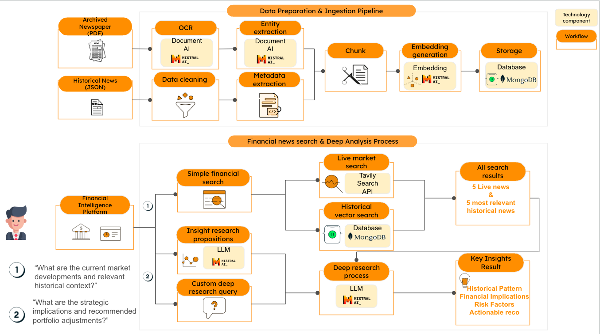

# 🏛️ AI Financial Research Platform

Transform 4 hours of financial research into 4 seconds with AI-powered insights.

## 🚀 Live Demo

[**Try the Live App →**](https://hanheloir.streamlit.app) 
- APP is available 24h/24h.
- However, DB is available only during working hours: from 8AM - 6 PM CET. You may not be able to get historical data is DB is turned off.

## 🎬 Architecture



## 🎬 Demo Video

[https://github.com/user-attachments/assets/demo-video.mp4](https://github.com/cozypet/News_FSI_July2025/blob/main/demo-video.mp4)

## ✨ Features

- **🔴 Live Market News** - Real-time financial news from top sources
- **📚 Historical Analysis** - 45+ years of archived Federal Reserve data
- **🤖 AI Insights** - Mistral AI-powered analysis and suggestions  
- **📄 Full Article Content** - Clickable articles with complete text
- **💡 Custom Analysis** - Ask your own financial questions

## 🛠️ Technology Stack

- **Frontend**: Streamlit
- **AI/ML**: Mistral AI (embeddings & chat)
- **Database**: MongoDB with vector search
- **News API**: Tavily for live financial news
- **Text Processing**: LangChain for document chunking

## 📊 Performance Impact

- **⚡ 1,800x faster** than traditional research
- **📊 45+ years** of historical data coverage
- **🎯 AI-powered insights** with cross-era analysis
- **🔍 Vector search** across millions of financial documents

## 🚀 Deployment on Streamlit Community Cloud

### Prerequisites

1. **API Keys Required:**
   - Mistral AI API key ([Get here](https://console.mistral.ai/))
   - Tavily API key ([Get here](https://tavily.com/))
   - MongoDB connection string ([Get here](https://www.mongodb.com/))

### Step-by-Step Deployment

1. **Fork/Clone this repository** to your GitHub account

2. **Go to [share.streamlit.io](https://share.streamlit.io)**

3. **Connect your GitHub account**

4. **Select your repository and main file:**
   - Repository: `your-username/News_FSI_July2025`
   - Branch: `main`
   - Main file path: `streamlit_demo_app.py`

5. **Add your secrets** in the Streamlit Cloud interface:
   ```toml
   MISTRAL_API_KEY = "your_mistral_api_key_here"
   TAVILY_API_KEY = "your_tavily_api_key_here"
   MONGO_CONNECTION_STRING = "your_mongodb_connection_string_here"
   ```

6. **Click "Deploy"** and wait for your app to build!

### Local Development

1. **Clone the repository:**
   ```bash
   git clone https://github.com/your-username/News_FSI_July2025.git
   cd News_FSI_July2025
   ```

2. **Install dependencies:**
   ```bash
   pip install -r requirements.txt
   ```

3. **Set up your API keys:**
   - Copy `.streamlit/secrets.toml` template
   - Add your actual API keys to the file
   - Or create a `.env` file with the same keys

4. **Run the app:**
   ```bash
   streamlit run streamlit_demo_app.py
   ```

## 🔒 Security Notes

- Never commit API keys to GitHub
- Use Streamlit secrets for deployment
- The `.streamlit/secrets.toml` file contains template values only

## 📁 Project Structure

```
News_FSI_July2025/
├── streamlit_demo_app.py           # Main Streamlit application
├── data_prep.py                   # JSON article processing pipeline
├── pdf_newspaper_processor.py     # Unified JSON + PDF processing with Mistral Document AI
├── requirements.txt               # Python dependencies
├── fed_articles_dataset.json      # Sample dataset (JSON format)
├── architecture-diagram.png       # System architecture visualization
├── demo-video.mp4                # Application demonstration
├── .streamlit/
│   └── secrets.toml              # Secrets template
└── README.md                     # This file
```

## 🤝 Contributing

1. Fork the repository
2. Create a feature branch
3. Make your changes
4. Submit a pull request

## 📄 License

This project is for demonstration purposes. Please ensure you have proper licenses for all APIs used.

## 🆘 Support

If you encounter any issues:
1. Check that all API keys are correctly configured
2. Verify your MongoDB connection string is valid
3. Ensure all dependencies are installed
4. Check the Streamlit logs for error details

## 🎯 Key Features Deep Dive

### **📊 Unified Data Processing**
- **JSON Articles**: Process structured financial articles via existing pipeline
- **PDF Newspapers**: Extract articles from PDF newspapers using Mistral Document AI
- **Auto-Detection**: Smart file type detection and routing
- **Batch Processing**: Handle entire directories of mixed file types

### **🔍 Advanced Search Capabilities**  
- **Live Market News**: Real-time financial news from trusted sources (WSJ, Bloomberg, Reuters)
- **Historical Vector Search**: 45+ years of Fed policy and market data
- **Cross-Era Analysis**: Compare current events to Volcker, Greenspan, Crisis, and Current eras
- **AI-Powered Suggestions**: Contextual follow-up questions generated by Mistral AI

### **🤖 AI Integration**
- **Mistral Document AI**: Intelligent PDF text extraction with layout understanding
- **Vector Embeddings**: Semantic search across financial documents
- **Deep Analysis**: Custom financial analysis powered by Mistral's language models
- **Smart Filtering**: Automatic financial content detection and relevance scoring

---

**Built with ❤️ for financial research professionals**
